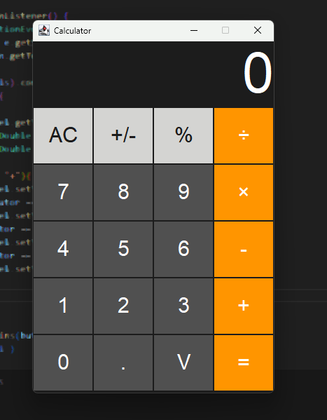

## JavaFX Calculator

A simple calculator application built using JavaFX.
It supports basic arithmetic operations such as addition, subtraction, multiplication, and division with a user-friendly graphical interface.

## Folder Structure

The workspace contains two folders by default, where:

- `src`: the folder to maintain sources
- `lib`: the folder to maintain dependencies

Meanwhile, the compiled output files will be generated in the `bin` folder by default.

> If you want to customize the folder structure, open `.vscode/settings.json` and update the related settings there.

## Dependency Management

The `JAVA PROJECTS` view allows you to manage your dependencies. More details can be found [here](https://github.com/microsoft/vscode-java-dependency#manage-dependencies).

## Update Code

- `src`: You can change source code from this folder.

- `Calculator`: Under this Java class you can change UI and make this calculator more advanced.

## 📸 Screenshots

